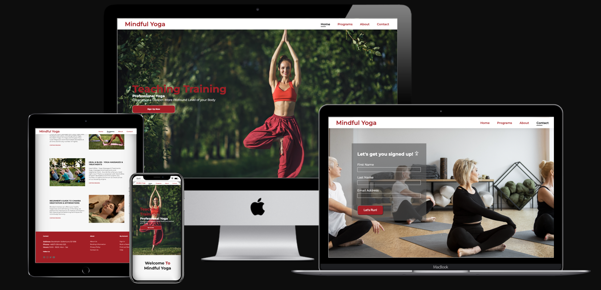

# Mindful Yoga

Welcome to Mindful Yoga, a website dedicated to promoting a healthy and balanced lifestyle through yoga, meditation. Our goal is to provide you with the resources and tools you need to cultivate a greater sense of well-being in your life.
In this Read Me, you will find information about the different sections of our website, including our yoga and meditation classes and tips for maintaining a healthy body and mind. I encourage you to explore each section and take advantage of the resources available to you.
Our yoga and meditation classes are designed for people of all levels, from beginners to advanced practitioners. We offer a variety of styles and class lengths, so you can choose the practice that best suits your needs and schedule. In our Body section, we provide tips and resources for maintaining a healthy body and mind, including information about exercise, self-care, and stress reduction techniques.
Thank you for visiting Mindful Yoga, and we hope you find our website to be a valuable resource for your journey towards greater health and well-being.

## Goals
### Vistor Goals
The target audience for Mindful Yoga:
*  Learn about the benefits of yoga and meditation for overall health and well-being.
*  Explore different styles of yoga and meditation practices, and find the one that suits their needs and preferences.
*  Access yoga and meditation classes that they can follow along with from home.
*  Find healthy and nutritious recipes that support their wellness goals.
*  Find inspiration and motivation for their own health and wellness journey.

### User Goals
Mindful Yoga fills visitors needs by:
*  To improve their physical fitness through practicing yoga and meditation regularly.
*  To find a supportive community of like-minded individuals who are also interested in wellness and mindfulness.
*  To gain a deeper understanding of the mind-body connection and how it affects overall health and well-being.
*  To connect with experienced yoga and meditation teachers who can guide them on their journey.
*  To improve their mental clarity and focus through meditation practices.

### Business Goals
The Business Goals of Mindful Yoga are:
* To generate revenue through the sale of products or services, such as courses, or online coaching sessions.
* To build a loyal customer base through ongoing engagement, social media, or other marketing channels.
* To establish partnerships with other businesses or organizations in the wellness industry.
* To continually update and improve website content in order to provide value to visitors and increase engagement.
* To build a strong online community around the Mindful Yoga brand, fostering a sense of connection and support for users.
* To develop and implement marketing strategies that effectively reach the target audience and communicate the unique value proposition of the Mindful Yoga brand.

## Visual Design

### Fonts
*  The primary font, Montserrat was chosen because it is standard, plain and informative but not too rigid. It looks friendly and conversational but holds a seriousness. It is also sans-serif, making it very easily readable throughout different color schemes and complementary to the font used for Headings.
* The secondary font, Julius Sans One was chosen because it is thin, elegant and refined yet it has flair. As a font, it gave me the impression of an art gallery. It is sans-serif, so it is clear, clean and simple, maintaining the idea of a minimalist aesthetic. It was chosen for headings as it is evident but doesn't distract, keeping the eyes more focused on the photography.

### Icons

   

* Icons are taken from  the [ionicons](https://ionic.io/ionicons Icon) library.
* They can easily be styled using other classes.
* Icons are utilised in the footer for social account icons and the form on the Contact page.

### Colors
* I wanted the site to maintain a minimal aesthetic, colors are very basic and clean for highlighting the photos.
* The primary color used is black. This is used to create a stark contrast with the background, drawing the eyes and focus on them. This removes distraction. White is used as the bakground color has more to do with lighting and reflection. On most computer screens, wherein the light is emitted from the screen.
* One accent color was chosen, the red to give a life connection to nature and training, the outdoors and travel.
* Text is primarily written in grey and black.
* Finally, a neutral grey color is used for the footer to set it apart from the other elements on the site.

