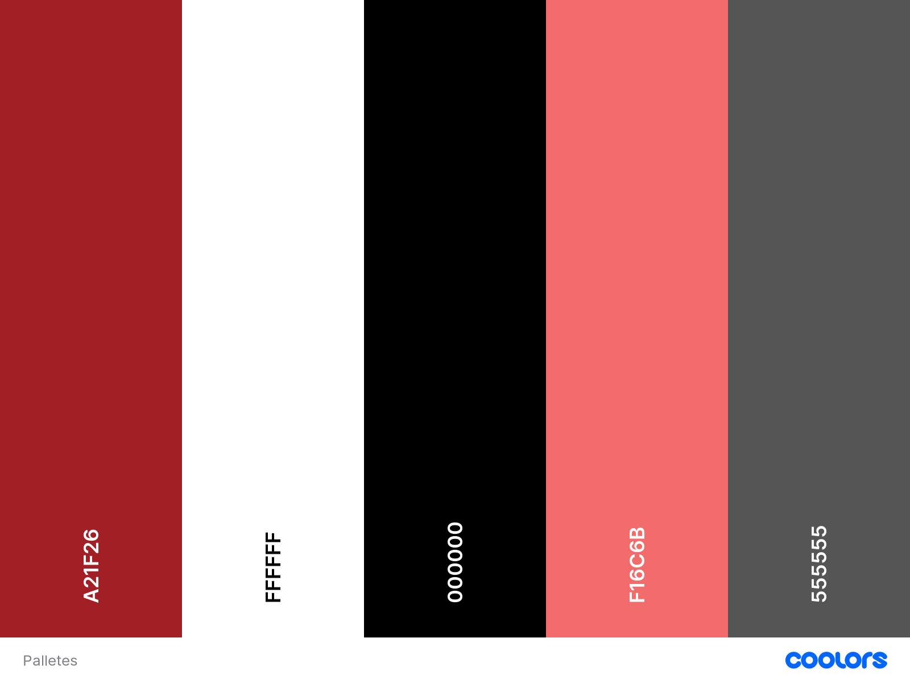

# Mindful Yoga

Welcome to Mindful Yoga, a website dedicated to promoting a healthy and balanced lifestyle through yoga, meditation. Our goal is to provide you with the resources and tools you need to cultivate a greater sense of well-being in your life.
In this Read Me, you will find information about the different sections of our website, including our yoga and meditation classes and tips for maintaining a healthy body and mind. I encourage you to explore each section and take advantage of the resources available to you.
Our yoga and meditation classes are designed for people of all levels, from beginners to advanced practitioners. We offer a variety of styles and class lengths, so you can choose the practice that best suits your needs and schedule. In our Body section, we provide tips and resources for maintaining a healthy body and mind, including information about exercise, self-care, and stress reduction techniques.
Thank you for visiting Mindful Yoga, and we hope you find our website to be a valuable resource for your journey towards greater health and well-being.
  

# Table of Contents

1. UX
    * Goals 

    * Visual Design
 
2. Features
    * Flexbox 

    * Page Elements 
      
2. Technologies Used
    * Languages

    * Platforms 

    * Other Tools
 
3. Testing
    * Methods

    * Bugs
    
4. Deployment
    * Github Deployment
    
5. Credit and Contact
    * Content

    * Contact
      

# Goals

## Vistor Goals
The target audience for Mindful Yoga:
*  Learn about the benefits of yoga and meditation for overall health and well-being.
*  Explore different styles of yoga and meditation practices, and find the one that suits their needs and preferences.
*  Access yoga and meditation classes that they can follow along with from home.
*  Find healthy and nutritious recipes that support their wellness goals.
*  Find inspiration and motivation for their own health and wellness journey.

### User Goals

Mindful Yoga fills visitors needs by:
*  To improve their physical fitness through practicing yoga and meditation regularly.
*  To find a supportive community of like-minded individuals who are also interested in wellness and mindfulness.
*  To gain a deeper understanding of the mind-body connection and how it affects overall health and well-being.
*  To connect with experienced yoga and meditation teachers who can guide them on their journey.
*  To improve their mental clarity and focus through meditation practices.
   

### Business Goals

The Business Goals of Mindful Yoga are:
* To generate revenue through the sale of products or services, such as courses, or online coaching sessions.
* To build a loyal customer base through ongoing engagement, social media, or other marketing channels.
* To establish partnerships with other businesses or organizations in the wellness industry.
* To continually update and improve website content in order to provide value to visitors and increase engagement.
* To build a strong online community around the Mindful Yoga brand, fostering a sense of connection and support for users.
* To develop and implement marketing strategies that effectively reach the target audience and communicate the unique value proposition of the Mindful Yoga brand.
 

## Visual Design

### Fonts

*  The primary font, Montserrat was chosen because it is standard, plain and informative but not too rigid. It looks friendly and conversational but holds a seriousness. It is also sans-serif, making it very easily readable throughout different color schemes and complementary to the font used for Headings.
* The secondary font is sans-serif, so it is clear, clean and simple, maintaining the idea of a minimalist aesthetic.
 

### Icons
  

   

* Icons are taken from  the [ionicons](https://ionic.io/ionicons Icon) library.
* They can easily be styled using other classes.
* Icons are utilised in the footer for social account icons and the form on the Contact page.
 

### Colors
  
 

* I wanted the site to maintain a minimal aesthetic, colors are very basic and clean for highlighting the photos.
* The primary color used is gray . This is used to create a stark contrast with the background, drawing the eyes and focus on them. This removes distraction. White is used as the bakground color has more to do with lighting and reflection. On most computer screens, wherein the light is emitted from the screen.
* One accent color was chosen, the  red to give a life connection to nature and training, the outdoors and travel.
* Text is primarily written in grey and headings in black and red.
* A neutral red color is used for the footer to set it apart from the other elements on the site and used for hover on links and buttons. 
 

### Styling

* Responsive web design has been enabled by Media Queries.
* links on each pages are re-used to direct the user to either the  contact page, program page, about page or home page no matter where they look.
* CSS flex box model has been used through out the website.
  

# Features

## Flexbox
Flexbox is a layout system that lets you create flexible and responsive designs with ease. With Flexbox, you can align and space items along a single axis or both axes at once.

Some cool things you can do with Flexbox include:

* Adjust the size of items based on their content or using percentages or other units.
* Align items horizontally or vertically, and distribute them evenly or with specific spacing.
* Change the order of items within a container without changing the HTML.
* Create layouts that work well on different screen sizes and devices.
To get started with Flexbox, check out some online resources like [A Complete Guide to Flexbox](https://css-tricks.com/snippets/css/a-guide-to-flexbox/) on CSS-Tricks or [Flexbox Froggy.](https://flexboxfroggy.com/) You can also experiment on your own by creating a simple HTML/CSS layout and using Flexbox properties to adjust the positioning and sizing of your elements. Good luck!
  

## Page Elements

### Navbar
  

* The Navbar is simple, provides four options with four different Pages, mainly Home page, About Page, Program Page and Contact pages, to maintain the flexible style.
* The Logo is always highlighted, swapping position as necessary depending on device size.
* The navbar is fixed so it is visible no matter how far you scroll.
 

### Hero Image
  

* Used as a welcome page that highlights information about the page and , representing a sense of adventure.
* An image with a person in it, is used so the viewer can connect with it on a personal level.
 

### About section
 

* After the initial image to give a strong impact, the about section has a text that talks about the brand’s aim and objectives.
* Hopefully, the impact will create enough interest to read about the the website.
* The section is responsive and the two columns will stack on resize.
* The section contains a fully responsive image and a small text section with responsively sized text.
* Contains a small link to a place where you can click and read more in the about section page.
 

### Testimonails section
 
 

* Builds Trust: To build trust with potential clients. Seeing positive feedback from past students can provide social proof that your classes are effective and worth attending.

* Demonstrates Effectiveness: By showcasing positive feedback from past students, it demonstrate the effectiveness of the website's teaching and highlight the benefits of its yoga practice.

* Increases Engagement: Reading about others' positive experiences can inspire visitors to try yoga themselves and potentially lead to increased sign-ups and class attendance, making the testimonials section a valuable tool for attracting new students to your yoga practice.
 

### Programs page
 

* To help users achieve their health and wellness goals through the regular practice of yoga and meditation.
* To continually evaluate and improve program offerings in order to meet the evolving needs and preferences of users.
* To provide users with resources and tools to help them maintain a healthy lifestyle, such as healthy and stress reduction techniques, and self-care practices.
* To offer high-quality yoga and meditation classes that provide users with the tools and techniques they need to establish a regular practice.
* To provide users with access to experienced and knowledgeable yoga and meditation instructors who can guide them on their journey.
 

### Healthy Tips
 

* To provide users with tips and resources for maintaining a healthy diet that supports their overall health and wellness goals.
* To encourage users to develop a consistent exercise routine that includes yoga, meditation, or other physical activities.
To offer guidance and support for users looking to reduce stress and improve their mental well-being through mindfulness practices.
* To provide users with information on natural remedies and holistic health practices that can support their overall health.
* To offer tips and resources for developing a healthy sleep routine, including practices such as relaxation techniques and sleep hygiene.

* To offer tips and resources for maintaining a healthy home environment, including tips for reducing environmental toxins and improving indoor air quality.
* To provide users with guidance on how to maintain healthy relationships and build a supportive community around them.
 

### Contact Page
 
 

* The form has validation and is fully responsive.
* Once the send button is pressed, a modal will open notifying the user that the message is sending.
 

### Footer
 

* Located at the bottom of every page, mainly highlighting contact, account information and privacy policy.
* Made of three columns, changing shape for larger or smaller devices.
* A message encouraging contact is used as the second column.
* The third column represents personal account, help and sign in.
  

# Technologies Used

## Languages
* HTML
    * Page markup.
* CSS
    * Styling.
     

## Platforms
* Github
    * Storing code remotely and deployment.
* Gitpod
    * IDE for project development.
     

## Other Tools

* [Mockup Generator](https://techsini.com/multi-mockup/index.php)
    * For device mockup images.

* [Prettier](https://prettier.io/)
    * For code indentation.
    
* [Coolors](https://coolors.co/)
    * Creating color pallettes.
    * Checking color contrast.

* [Freepick](https://www.freepik.com/)
    * Acquiring images.

* [Icons](https://ionic.io/ionicons)
    * Creating icons.

* [Favicon Generator](https://favicon.io/favicon-generator/)
    * Favicons.

* [ImageOptim](https://imageoptim.com/mac)
    * Optimising images.
      

# Testing

## Methods

### Validation
* HTML has been validated with W3C HTML5 Validator.
* CSS has been validated with W3C CSS Validator and auto-prefixed with CSS Autoprefixer.
* Links checked with W3C Link Checker.

### General Testing
* Each page was developed and tested in on its own before being joined with together for luching.
* The site was sent to friends for feedback and testing.
* All forms have validation and will not submit without the proper information.

### Mobile Testing
* I tested the site personally using the responsively app and my phone, going through the entire process, checking buttons, etc. 
* The site was sent to friends and relatives for them to follow the same process. They have tested on their devices, including iOS.
* Chrome was utilised to inspect the site in mobile format, going through the pages and links.

### Desktop Testing
* The site was developed on a Chromebook and, as such, the majority of testing occurred on Chrome.
* The site was tested by friends and relatives on numerous desktop devices.
* The site was marginally tested on other browsers, such as Firefox.

## Bugs
 
 
### Known Bugs

* Occasionally on a device with slow connections, images won't load.
* Very slow connections may have users see the thumbnails pop in during iframe loading

### Fixed Bugs
* Optimize images for load faster on slow connections.
  

# Deployment 

## Github Deployment
* First, I created a new repository on GitHub and named it "Minful-yoga". Then, I opened the repository in Gitpod by clicking the "Gitpod" button in the top right corner of the repository page.

* Once my Gitpod workspace was set up, I created a new branch called "Mindul-yoga" for my website files, and added a new directory in my repository called "Mindful-yoga" where I put all of my website files.

* Next, I added my website files to my Git repository using Git commands like git add and git commit.

* Finally, I enabled GitHub Pages for my repository by going to the "Settings" tab on my repository page, scrolling down to the "GitHub Pages" section, and selecting "Branch: website" under "Source".

That's it! Now my yoga website is deployed on GitHub and accessible to anyone at https://[username].github.io/yoga-website. With Gitpod, the entire process was made much easier and streamlined.
 

### Github Preparation
* It is possible to copy or clone the repository to directly for deployment.
* A free GitHub account.

### Github Instructions
1. Log in to your GitHub account. navigate to .
2. You can set up your own repository and copy or clone it, or you fork the repository.
3. git add, git commit and git push to a GitHub repository, if necessary.
4. GitHub pages will update from the master branch by default.
5. Go to the Settings page of the repository.
6. Scroll down to the Github Pages section.
7. Select the Master Branch as the source and Confirm the selection.
8. Wait a minute or two and it should be live for viewing. 
  

# Credits and Contact

## Content
Nearly all text content was generated by the AI, [Openai](https://chat.openai.com/auth/login).I thought it would be a fun addition to the project Any code utilised from a site is documented and credited within the code. All photographs can be found [here](https://www.freepik.com/). All other media used is my own.

## Contact
Please feel free to contact me at @gassamasaikou@yahoo.com

